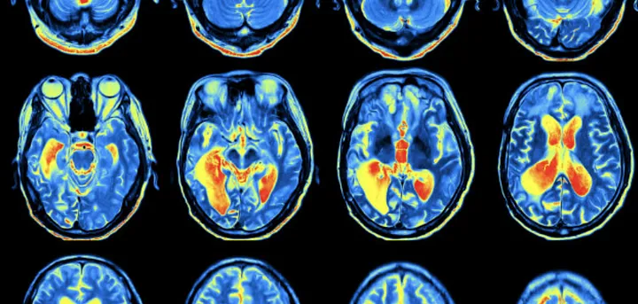

<!-- PROJECT SHIELDS -->
[![Contributors][contributors-shield]][contributors-url]
[![Forks][forks-shield]][forks-url]
[![Stargazers][stars-shield]][stars-url]
[![Issues][issues-shield]][issues-url]
[![MIT License][license-shield]][license-url]
[![LinkedIn][linkedin-shield]][linkedin-url]

<!-- PROJECT LOGO -->
 

  

<h3 align="center">BrainLens: Image Reconstruction from Brain fMRI imaging using Diffusion Models</h3>

  

<!--     <a href="https://github.com/ahmed-alllam/BrainLens">View Demo</a> -->
<!--     · -->
    <a href="https://github.com/ahmed-alllam/BrainLens/issues">Report Bug</a>
    ·
    <a href="https://github.com/ahmed-alllam/BrainLens/issues">Request Feature</a>
  

<!-- ABOUT THE PROJECT -->

## About The Project

This project aims to reconstruct visual images from brain fMRI data using diffusion models. The project is inspired by the paper [Reconstructing the Mind's Eye: fMRI-to-Image with Contrastive Learning and Diffusion Priors](https://arxiv.org/abs/2305.18274).

The basic idea of the project is to train a model to reconstruct images from fMRI data. The model is split into two main pipelines, one to capute higher-level semantic features of the image from fMRI data, and the other one to capture the lower-level details of the image. The first pipeline is trained using contrastive learning to make the latent representation of the fMRI similar to the CLIP embedding of the image, and thus the model is able to capture the semantic features of the image. The second pipeline is trained using diffusion autoencoder models to capture the lower-level details of the image. The two pipelines are then combined to reconstruct the image from the fMRI data using Versatile Diffusion model.

> **Note**
> This project is still under development and is not yet ready for deployment, but feel free to fork it and use it for your own purposes!

## Data Source

The dataset used in this project is from the Natural Scenes Dataset (NSD), which is a large-scale fMRI dataset conducted at ultra-high-field (7T) strength at the Center of Magnetic Resonance Research (CMRR) at the University of Minnesota. The dataset consists of whole-brain, high-resolution fMRI measurements of 8 healthy adult subjects while they viewed thousands of color natural scenes over the course of 30–40 scan sessions. While viewing these images, subjects were engaged in a continuous recognition task in which they reported whether they had seen each given image at any point in the experiment. [^1^]

## Tech Stack

The project utilizes the following technologies and libraries:

- 
- 
- 
- 
- 
- 

### References

[^1^]: [Natural Scenes Dataset (NSD)](https://naturalscenesdataset.org/)

<!-- MARKDOWN LINKS & IMAGES -->
[contributors-shield]: https://img.shields.io/github/contributors/ahmed-alllam/BrainLens.svg?style=for-the-badge
[contributors-url]: https://github.com/ahmed-alllam/BrainLens/graphs/contributors
[forks-shield]: https://img.shields.io/github/forks/ahmed-alllam/BrainLens.svg?style=for-the-badge
[forks-url]: https://github.com/ahmed-alllam/BrainLens/network/members
[stars-shield]: https://img.shields.io/github/stars/ahmed-alllam/BrainLens.svg?style=for-the-badge
[stars-url]: https://github.com/ahmed-alllam/BrainLens/stargazers
[issues-shield]: https://img.shields.io/github/issues/ahmed-alllam/BrainLens.svg?style=for-the-badge
[issues-url]: https://github.com/ahmed-alllam/BrainLens/issues
[license-shield]: https://img.shields.io/github/license/ahmed-alllam/BrainLens.svg?style=for-the-badge
[license-url]: https://github.com/ahmed-alllam/BrainLens/blob/master/LICENSE.txt
[linkedin-shield]: https://img.shields.io/badge/-LinkedIn-black.svg?style=for-the-badge&logo=linkedin&colorB=555
[linkedin-url]: https://linkedin.com/in/ahmed-e-allam
[product-screenshot]: images/screenshot.png
